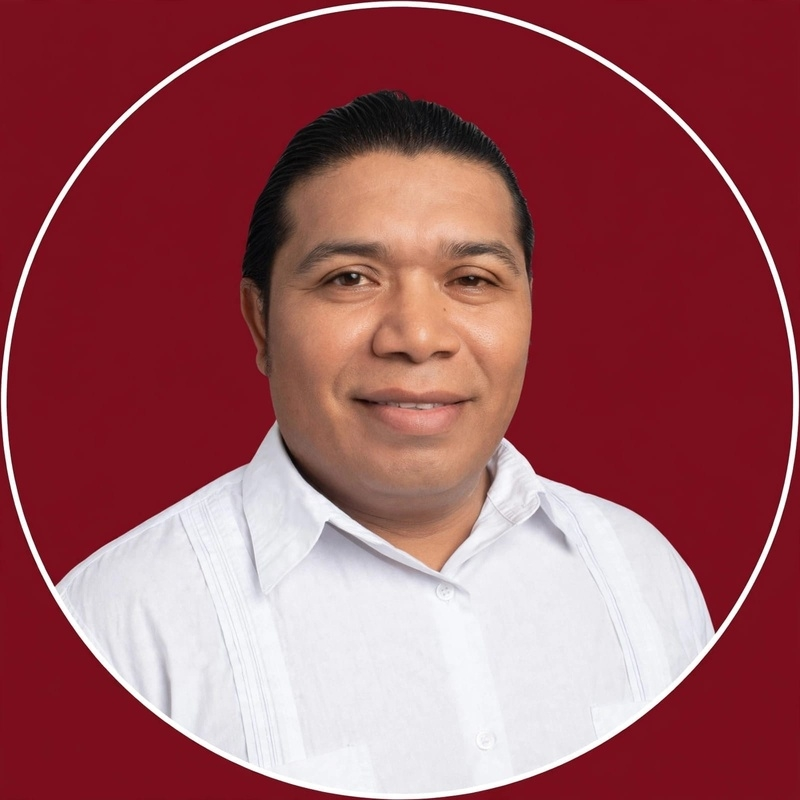

# 🏠 KANASÍN ES NUESTRA CASA
### VISIÓN CIUDADANA 2027-2030

### Eduardo Javier Mora González
*Un ciudadano más de Kanasín, la tierra que me da de comer*

---
> Este no es un partido. Es la visión de un vecino.

### 🧑‍🤝‍🧑 ¿Qué es VISIÓN CIUDADANA?
Un proyecto ciudadano 2027-2030 donde **TÚ propones cómo mejorar Kanasín**. Si el pueblo así lo quiere, vamos por la alcaldía. Si no, nos quedamos con un mejor Kanasín.

**NO SOY CANDIDATO AÚN.** Solo ejerzo mi derecho ciudadano (Art. 35 Constitución). No afiliado a ningún partido.

### 📲 MI PROPUESTA CIUDADANA

**Hermano Kanasinense, si estás cansado de seguir en el olvido, viviendo las omisiones a todos nuestros derechos constitucionales, ven, sumémonos a este gran proyecto visionario y transformador para el futuro de nuestros hijos.**

**Dejemos a nuestros hijos una de las culturas que ellos jamás creyeron tener:**

**TALLERES DE AUTOSUFICIENCIA PERSONAL:**
Desde aplicación de uñas gelish, francesas, pedicure, manicura, corte de cabellos, peinados mohicanos, trenzas africanas.

Dejemos enseñanzas a nuestros hijos para que en un futuro ellos sepan también de ser profesionales, brindar servicios de humildad a nuestra sociedad.

### 📞 ¿Te sumas a la VISIÓN?

**WhatsApp: 999 764 6962**

### 📜 Me respalda la ley
*   **Art. 35 CPEUM:** Derecho a asociarme
*   **Art. 75-76 Ley de Gobierno Municipal de Yucatán**
*   **Art. 42 LIPEEY IEPAC**
